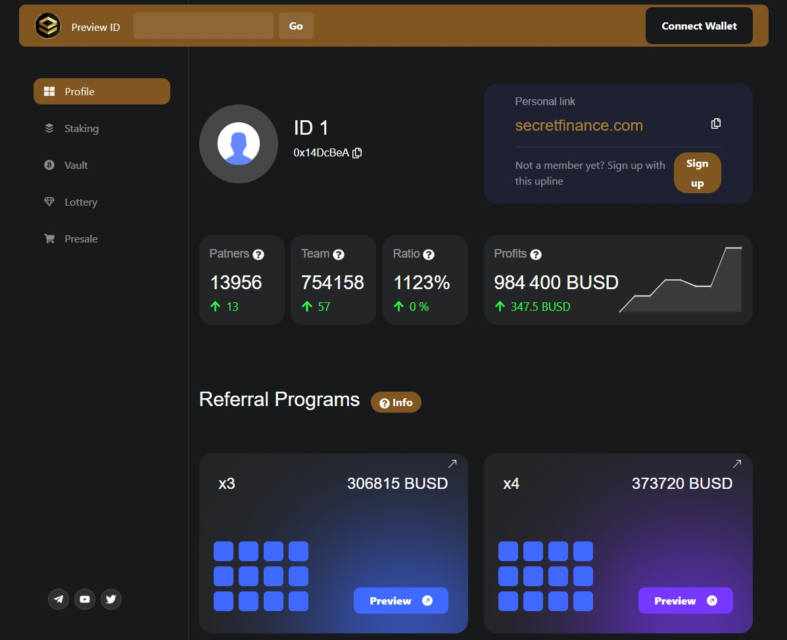

# secret-wallet-react-mock

> ## Create-React-App, MDB React

```yml
Your Secure Smart Vaults

Secret Finance

Mint Smart Vaults, stake RVST, NFTs, make illiquid positions liquid and much more!

Tested Node.js version: 16.16.0
```


## Available Scripts

### `npm start`

Runs the app in the development mode.\
Open [http://localhost:3000](http://localhost:3000) to view it in your browser.

The page will reload when you make changes.\
You may also see any lint errors in the console.

### `npm test`

Launches the test runner in the interactive watch mode.\
See the section about [running tests](https://facebook.github.io/create-react-app/docs/running-tests) for more information.

### `npm run build`

Builds the app for production to the `build` folder.\
It correctly bundles React in production mode and optimizes the build for the best performance.

### `npm run eject`

---

&copy; 2022-2023 @liyang51827

All Rights Reserved.

